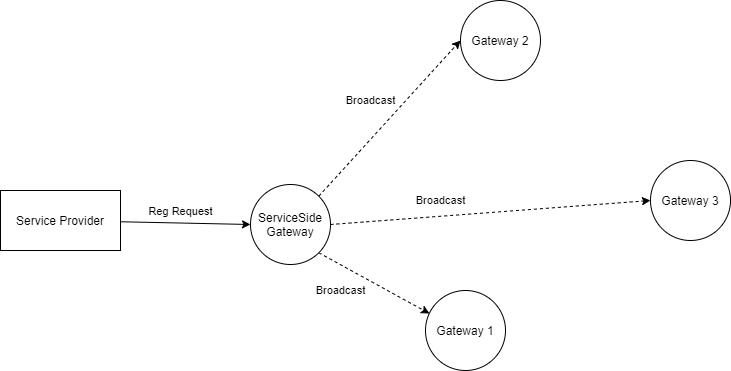
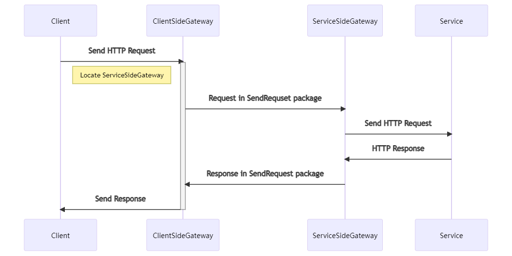
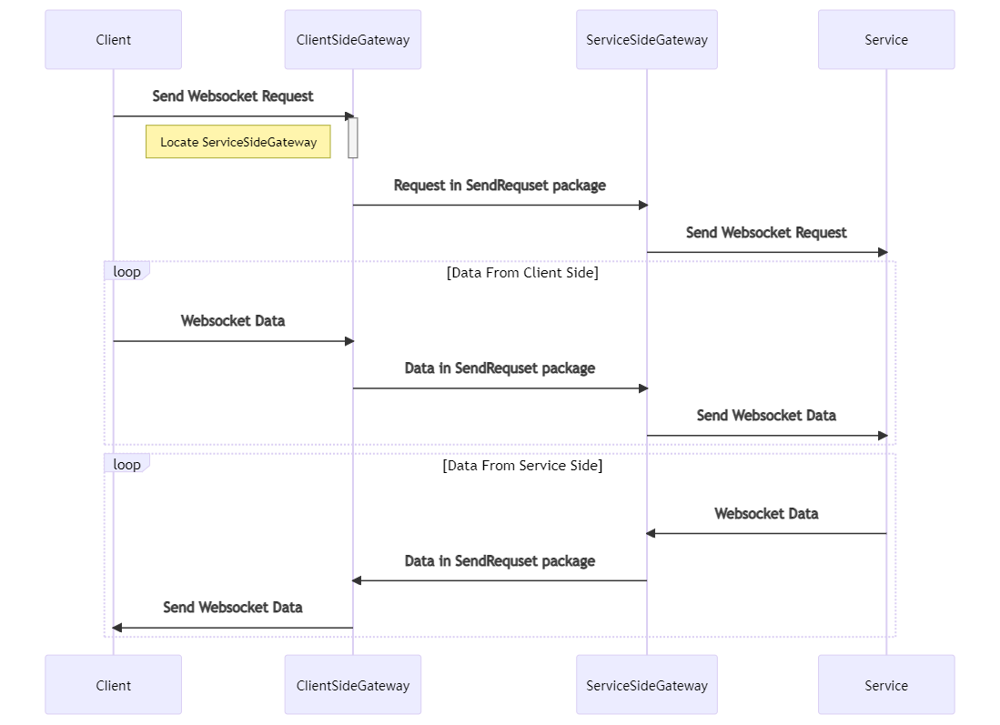

# Tech detail of Rust Gateway

This document describes the tech detail of p2p data transfer between Apron Gateways,
and the communications between Apron Nodes.

## Network Design

In Apron Network, there are two individual p2p networks, one is used for Apron Nodes, and the other is for Apron Gateways. 
Here are the considerations of this design:

* Security: The separated network protects core Apron Nodes network from data transferred between Apron Gateways, which can avoid potential attacks caused by Gateway side bugs or vulnerability.
* Isolation: There will be lots of data transmission between Apron Gateway network after services increased, which may delay the processing of core network event.

### Entities

The typical network model contains 4 entities:

* Service: The entity provides service. Currently only HTTP(S) / WS(S) services are supported. The service can register its service to the Gateway (ServiceSideGateway), then it can be used by Client from all the network.
* ServiceSideGateway: The gateway registers the service. In this Gateway data store, all registered service are marked as local services, while the services pushed by gossip protocol are saved as remote_services.
* ClientSideGateway: The gateway communications with client. It package request sent from Client to internal data package and forward to correct ServiceSideGateway.
* Client: The entity request to using services.

The below document is based on those 4 entities.

### Data Types

The Apron Gateway is built based on built-in kDHT network of rust-libp2p library, which will not be touched in this document.
Here are the data types will be transmitted after network created:

* Service update: All services related data, includes create, update, delete operations. Those types of data are transferred between both Gateway networks and Node RPC call.
* Init request: First request sent from Client side. The typical scenarios are connect instruction for HTTP(S) Websocket request.
* Data package: Package for data of requests, typical scenarios are streamed websocket data transferred.
* Usage data: Service usage data, will be uploaded to Apron Node via RPC call.

All data described above will be serialized to binary format and sent via network.
Package size will be sent in advanced of real package, which can help decoder side to get correct data.

## Data Flow 

The data flow contains service management and request forwarding.

### Service Management

This data flow contains all management tasks for services, which includes Create, Update and Delete.
The data flow for those operations are similar, so the following diagram will only show data flow for service creation.

### Request Forward

Forwarding request uses the `libp2p::request_response` protocol to transfer data between Gateways.
The internal data for `SendRequest` is `DataExchangeRequest` struct,
which contains numeric field `schema` and bytes array field `data`. Currently there are 4 schemas:

* 0: InitRequest sent from Client
* 1: Websocket data sent from Client
* 2: Websocket data sent from Service
* 3: HTTP data sent from Service

#### Init Request

The first request sent from client will handled by Actix web server running in ClientSideGateway,
after getting service detail from internal storage,
ClientSideGateway builds the package and sent out via p2p network by `SendRequest` protocol.
In ServiceSideGateway, after decoded the request, there will be two code branches.
For HTTP(S) request, a blocking HTTP request will be sent via `reqwest` library,
after getting response, the data will also be sent back via `SendRequest` to ClientSideGateway.

This diagram shows full HTTP request/response flow. The websocket diagram will be put in next section.

#### Data Package

Data packages are also transferred via `request_response` protocol.
As described above, the data will be transferred in two different types.
Diagram below shows the data flow of Websocket data exchange. The first request is similar with HTTP request,
which indicate ServiceSideGateway to create Websocket connection.
After connection built, the data will be transferred in two separated channels between ClientSideGateway and ServiceSideGateway.

## Problems of Integrating into Substrate Running Env

At the beginning, we plan to integrate gateway to substrate running env as pallet,
but after some investigation, we found those problems:

* External port support. All data passed in should be passed by Substrate node, which requires changes in Substrate part, which requires lots of external workload.
* Security. As talked above, the service should be opened to public network, which may bring potential security issues.
* Network capacity. Forwarding functions require much more bandwidth and processing than Substrate node, integrating them in one running space may increase failure rate of both side.
* Http stack support. Forwarding requires gateway provides HTTP/Websocket support to client, currently running Actix web framework in non-std env has little discussion.

So the standalone plan has been used for this milestone.
